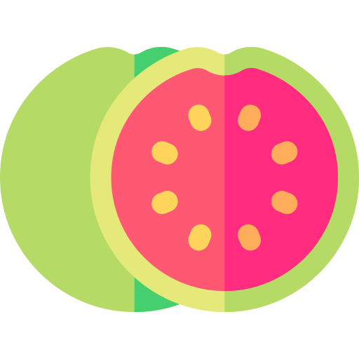
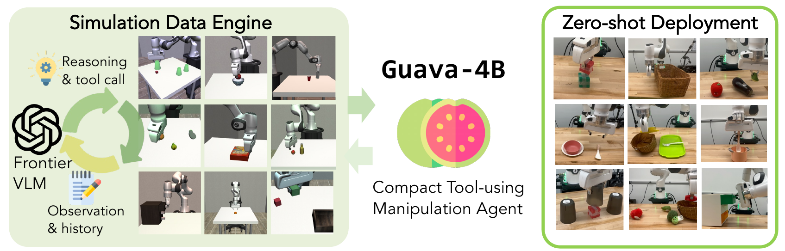
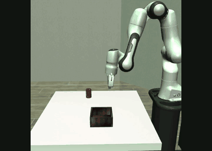
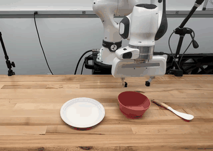
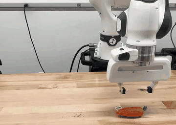
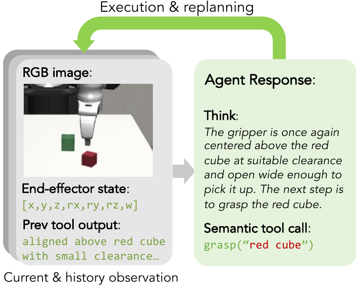
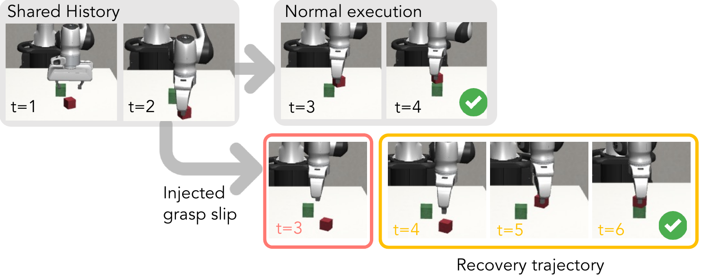
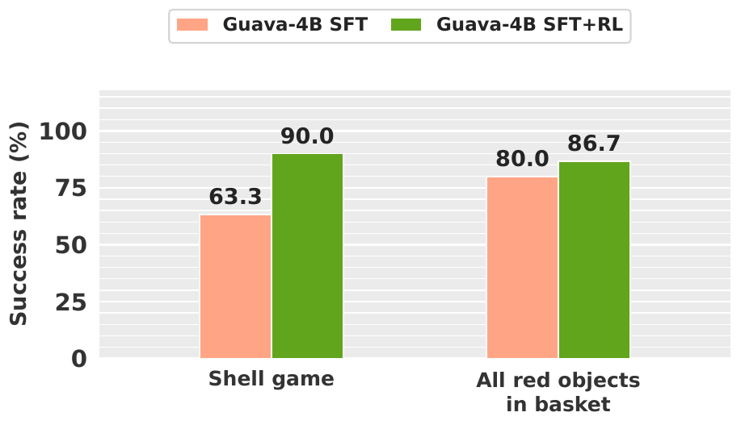
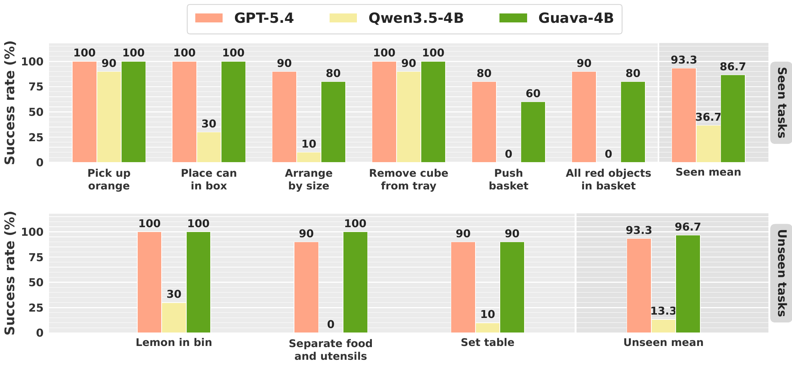

<div align="center">
  
  <h1>Guava</h1>
  <p><strong>Distilling Frontier VLMs into a Compact Agent through a Robotic Manipulation Harness</strong></p>
  <p>
    <a href="https://guava-harness.github.io/">🌐 Project Page</a>
    &nbsp; · &nbsp;
    <a href="https://arxiv.org/abs/2606.18363">📄 Paper</a>
    &nbsp; · &nbsp;
    <a href="https://huggingface.co/AIcell/guava-v13b-qwen3.5-4b">🤗 Guava-4B Model</a>
  </p>
</div>

**Guava** distills frontier vision–language models into a compact robot agent
through a shared manipulation harness. Using **GPT-5.4** as the teacher, we
collect **just over 2,000 simulation trajectories** and fine-tune
**Qwen3.5-4B** to obtain **Guava-4B**. The teacher and student use the same
observation, tool, and execution-feedback interface.

Guava-4B approaches its teacher's performance with **87.1% simulation success**
and **90.0% real-world success**, without real-world fine-tuning. On a single
RTX 5090, it reduces mean model-call latency by **7.10×** and generated tokens
per episode by **66.7%** relative to the GPT-5.4 API in the reported evaluation.
See [paper results](#results) for protocols and comparisons.

This repository provides the simulation harness, a **15-task benchmark**,
trajectory collection with perturbation and recovery branches, and SFT/GRPO
training tools.

| | What you can do |
| --- | --- |
| 🦾 **Evaluate** | Run hosted VLMs, local Qwen models, or Guava checkpoints on manipulation tasks. |
| 🧪 **Collect** | Generate trajectories, introduce perturbations, and collect recovery branches. |
| 🧠 **Train** | Distill tool-use behavior with supervised fine-tuning and improve policies with GRPO. |

[](assets/videos/guava_v3.mp4)

**[▶️ Watch the overview](assets/videos/guava_v3.mp4)** · **[🌐 Explore the project page](https://guava-harness.github.io/)**

**Jump to:** [🎥 Demos](#demos) · [🦾 Harness](#harness) · [📈 Results](#results) · [📦 Installation](#installation) · [🚀 Quick start](#quick-start) · [📊 Benchmark](#benchmark) · [🧪 Data collection](#data-collection) · [🧠 Training](#training) · [⚙️ Configuration](#configuration) · [🎬 Videos](#videos) · [🦾 Real world](#real-world) · [📚 Citation](#citation)

<a id="demos"></a>

## 🎥 Demos

| 🧪 Simulation | 🦾 Real-world manipulation | 🔄 Failure recovery |
| :---: | :---: | :---: |
| [](assets/videos/can_in_bin_sim.mp4) | [](assets/videos/set_table.mp4) | [](assets/videos/recovery_move.mp4) |
| [▶️ Place the can in the box](assets/videos/can_in_bin_sim.mp4) | [▶️ Set the table](assets/videos/set_table.mp4) | [▶️ Recover from a moved object](assets/videos/recovery_move.mp4) |

Select a preview to open the full MP4 video. The previews retain the source clips'
playback speed at a reduced resolution and frame rate.
See [media sources](assets/README.md) for the original project-page assets.

<a id="harness"></a>

## 🦾 A shared manipulation harness

The harness exposes the same interface during teacher data collection and
student deployment. Each turn combines three elements:

- **Single-action replanning:** observe, reason, execute one action, and use the
  returned feedback to choose the next action.
- **Semantic action tools:** object-referenced operations such as grasp and
  align handle robot control through reusable manipulation skills.
- **Multimodal feedback:** RGB images, numerical gripper state, and tool-response
  text describe the scene and execution outcomes.

<p align="center">
  
</p>

Teacher trajectories supervise the student's interleaved reasoning and tool
calls. Training data includes both ordinary task execution and successful
recoveries from injected execution deviations, such as missed grasps and
dropped objects.

<a id="results"></a>

## 📈 Results from the paper

The following results are reported in the revised paper and on the
[project page](https://guava-harness.github.io/#results).

### Simulation and real-world transfer

| Evaluation | GPT-5.4 | Qwen3.5-4B | Guava-4B |
| --- | ---: | ---: | ---: |
| Simulation success (%) | 90.4 | 22.2 | **87.1** |
| Real-world success (%) | 93.3 | 28.9 | **90.0** |

Simulation uses **15 tasks with 30 trials per task**; real-world evaluation
uses **9 tasks with 10 trials per task**, without real-world fine-tuning.
All models use the full harness. Bold values highlight Guava-4B.

<details>
<summary>Simulation generalization and the effect of perturbation data</summary>

| Task group | GPT-5.4 | Qwen3.5-4B | Guava-4B | Guava-4B without perturbations |
| --- | ---: | ---: | ---: | ---: |
| Seen (7 tasks) | 86.7 | 23.8 | 82.9 | 81.9 |
| Unseen (8 tasks) | 93.8 | 20.8 | 90.8 | 77.1 |
| Overall | 90.4 | 22.2 | 87.1 | 79.3 |

Values are success percentages. Unseen tasks include new objects, instructions,
and longer action sequences. Adding perturbation and recovery trajectories
improves Guava-4B's unseen-task success from **77.1% to 90.8%**.

</details>

### Generalization to LIBERO-PRO

Guava-4B is also evaluated on LIBERO-PRO without benchmark-specific fine-tuning.
Success rates below are on a **0–1 scale**, averaged across the object, goal,
and spatial suites.

| Perturbation | GPT-5.4 | Qwen3.5-4B | Guava-4B |
| --- | ---: | ---: | ---: |
| Initial position | 0.45 | 0.06 | **0.41** |
| Task instruction | 0.44 | 0.03 | **0.41** |

These are paper results; the [benchmark commands below](#benchmark) run this
repository's 15-task simulation benchmark.

### Efficient local inference

| Metric | GPT-5.4 API | Guava-4B on one RTX 5090 |
| --- | ---: | ---: |
| Mean model-call latency (s) | 4.168 | **0.587** |
| Model-request time per episode (s) | 42.10 | **5.64** |
| Generated tokens per episode | 2,389 | **795** |

Results are means over **30 episodes on three tasks per model**; model-call
latency is averaged over requests. The **7.10× reduction in model-call latency**
and **66.7% reduction in generated tokens** measure model inference, not
end-to-end robot execution time.

<a id="installation"></a>

## 📦 Installation

### 1. Check prerequisites

- **Platform:** Linux x86-64 and Python 3.11.
- **Hardware:** a CUDA-capable GPU. Development and validation used Ubuntu with an RTX 5090; other hardware may need different serving settings.
- **Tools:** Git and `uv` (validated with uv 0.11.24).
- **Perception weights:** obtain access to [SAM3 on Hugging Face](https://huggingface.co/facebook/sam3) using your own account.

### 2. Clone and initialize

```bash
git clone --branch main https://github.com/hdacnw/guava-release.git
cd guava-release
git submodule update --init third_party/robosuite third_party/sam3
python3 scripts/setup_sam3_compat.py
python3 scripts/setup_sam3_compat.py --check
```

### 3. Create the runtime environments

| Environment | Dependency group | Purpose |
| --- | --- | --- |
| `.venv-eval` | `eval` | Simulation, hosted-model clients, collection, and data preparation |
| `.venv-sam3` | `sam3` | SAM3 perception |
| `.venv-serve` | `serve` | Local vLLM inference; needed for local Qwen or Guava checkpoints |

Create the evaluation and perception environments:

```bash
UV_PROJECT_ENVIRONMENT=.venv-eval uv sync --locked --no-default-groups --group eval
UV_PROJECT_ENVIRONMENT=.venv-sam3 uv sync --locked --no-default-groups --group sam3
export MUJOCO_GL=egl
```

For **local models**, also create the serving environment:

```bash
UV_PROJECT_ENVIRONMENT=.venv-serve uv sync --locked --no-default-groups --group serve
```

> [!IMPORTANT]
> Keep these environments separate: SAM3 and vLLM require different Torch versions.
> Do not use `--all-groups` or sync multiple groups into one environment.
> Use the explicit environment paths above; a bare `uv sync` targets `.venv`.

<details>
<summary>🔧 Dependency, CUDA, and environment details</summary>

Dependencies are declared in [pyproject.toml](pyproject.toml) and resolved in
[uv.lock](uv.lock). The lockfile targets Linux x86-64 and Python 3.11.
CUDA wheel sources are already configured; no extra package-index flags are needed.

Local serving requires a host C++ compiler, such as Ubuntu's `build-essential`
package. The serving group includes matching CUDA compiler/headers and Ninja
for JIT builds. The managed evaluation launcher also creates missing CUDA linker
symlinks inside the serving environment for FlashInfer. A caller-supplied
`CUDA_HOME` is left untouched and must point to a complete compatible toolkit.

A bare `uv sync` defaults to the `eval` group in `.venv`. Syncing an existing
environment removes packages not needed by its selected group, so use a fresh
path if you need to preserve a previous setup. After editing dependencies,
run `uv lock` and commit both configuration and lockfile.

Fine-tuning uses a [fourth environment](#training). The optional GraspGen server
is also a separate installation.

</details>

<a id="quick-start"></a>

## 🚀 Quick start: evaluate a model

Hosted models use **OpenRouter by default**. Set `OPENROUTER_API_KEY` in your shell environment.

Preview a one-episode evaluation without starting services or making API calls:

```bash
.venv-eval/bin/python -m guava.inference.run_study \
  --models openai/gpt-5.4 --tasks can_in_bin --episodes 1 \
  --output runs/gpt-can-in-bin --dry-run
```

Remove `--dry-run` to execute. The launcher manages SAM3 automatically and also
starts vLLM when a local model is selected. Keep ports 8000 and 8114 available,
or use `--external-servers` with exactly one model to use your own services.

### 🔌 Choose a model or provider

Use the exact model ID from your provider or Hugging Face model card—no
Guava-specific model aliases are required.

| Provider             | Example selection                                        |
| -------------------- | -------------------------------------------------------- |
| OpenRouter (default) | `--models openai/gpt-5.4`                                |
| Direct OpenAI        | `--provider openai --models gpt-5.4`                     |
| Local Qwen           | `--provider local --models Qwen/Qwen3.5-4B`              |
| Local Guava          | `--provider local --models AIcell/guava-v13b-qwen3.5-4b` |

For another hosted VLM, pass its provider model ID directly to `--models`.
Set `OPENROUTER_API_KEY` for OpenRouter or `OPENAI_API_KEY` for direct OpenAI.

### 🤗 Evaluate your own checkpoint

```bash
.venv-eval/bin/python -m guava.inference.run_study \
  --provider local --models /absolute/path/to/checkpoint --prompt-profile sft \
  --tasks can_in_bin --episodes 1 --output runs/custom-checkpoint
```

For a Hugging Face checkpoint, use `--provider local --models ORGANIZATION/MODEL`.
The listed Qwen/Guava checkpoints have pinned revisions. Other Hugging Face models
require `--revision COMMIT`, with one model per invocation when overriding a
revision.

Use `--prompt-profile sft` for the short SFT prompt, or `--prompt-profile long`
for the long data generation prompt.

<a id="benchmark"></a>

## 📊 Run the benchmark

```bash
.venv-eval/bin/python -m guava.inference.run_study \
  --provider local --models Qwen/Qwen3.5-4B AIcell/guava-v13b-qwen3.5-4b --episodes 30 --seed 42 \
  --output runs/benchmark --dry-run
```

Without `--tasks`, all 15 tasks run. With no model/provider flags, the default is
`openai/gpt-5.4` through OpenRouter. Choose a new output directory under
`runs/` or `data/`.

| Task ID                     | Task                                                             | Default turn cap |
| --------------------------- | ---------------------------------------------------------------- | ----------------: |
| `can_in_bin`                | Place the can in the box                                         | 25               |
| `apple_juice_order`         | Arrange apple and juice bottle by increasing size, left to right | 25               |
| `apple_juice_reverse_order` | Arrange apple and juice bottle by decreasing size, left to right | 25               |
| `remove_cube_from_tray`     | Remove the cube from the tray                                    | 25               |
| `push_basket`               | Push the basket left or right                                    | 25               |
| `close_drawer`              | Close the drawer                                                 | 25               |
| `pick_up_carrot`            | Pick up the carrot                                               | 25               |
| `tomato_near_potato`        | Move the tomato nearer the potato                                | 25               |
| `lemon_in_bin`              | Place the lemon in the bin                                       | 25               |
| `push_pot`                  | Push the pot left or right                                       | 25               |
| `cube_stack_reverse`        | Stack the green cube on the red cube                             | 25               |
| `bin_and_tray_simple`       | Put food in the bin and utensils on the tray                     | 30               |
| `set_table`                 | Set the table                                                    | 30               |
| `shell_game`                | Retrieve and lift the hidden cube                                | 30               |
| `red_objects_in_basket`     | Place all red objects in the basket                              | 30               |

**Configuration:** `--max-turns N` overrides both action and decision caps.
The default protocol uses full tool access, PCA grasping, motion speed 1, and
20 initial settling steps, adjustable through the per-task YAML files in
[configs/](configs/). Shell Game uses `sideview`; other tasks use `frontview`.

**Outputs:** manifests, prompts, responses, action logs, images, parser audits,
and episode results.

<a id="data-collection"></a>

## 🧪 Data collection



The paper's data pipeline uses GPT-5.4 in randomized MuJoCo scenes, combining
base trajectories with successful recovery branches. Simulator outcome labels
are checked automatically and reviewed visually; supported annotation errors
are corrected and unresolved episodes are excluded. The commands below expose
the collection and preparation stages.

### 1. Start perception

Run SAM3 in a separate terminal:

```bash
.venv-sam3/bin/python -m guava.scripts.sam3_server --port 8114 --device cuda
```

### 2. Collect a base trajectory

With `OPENROUTER_API_KEY` set:

```bash
.venv-eval/bin/python -m guava.scripts.collect_release \
  --task can_in_bin --trials 1 --seed 42 --max-turns 25 \
  --output data/collect/can_in_bin
```

Use `--model PROVIDER_MODEL_ID` to select another model, or `--provider openai`
for direct OpenAI models. Add `--dry-run` to inspect settings. Change `--seed`
for a different set of initializations.

### 3. Collect perturbation and recovery branches

Generate perturbation and recovery branches from the collected checkpoints:

```bash
.venv-eval/bin/python -m guava.scripts.collect_branches \
  --config configs/can_in_bin.yaml \
  --baseline_dir data/collect/can_in_bin \
  --output_dir data/branches/can_in_bin --max-branches 3 \
  --perturbations grasp_failure object_moved_align drop_during_transport \
  --dryrun
```

Remove `--dryrun` to generate branches. Use `--trial_ids` and `--turns` to
select parent trials and intervention points. Available perturbations are
`grasp_failure`, `wrong_object`, `drop_during_transport`,
`object_moved_align`, `wrong_approach_side`, and `wrong_orientation`.

Branches restore simulator/controller state and preserve parent history.

### 4. Filter and prepare data

```bash
.venv-eval/bin/python scripts/filter_trajectories.py \
  data/collect/can_in_bin data/branches/can_in_bin \
  --output data/can-in-bin-filter.json
```

Filtering writes an acceptance manifest; it does not modify source trajectories
or assemble a training dataset. It checks format, labels, images, duplicates,
action limits, and available provenance. Visual review is still necessary.

After assembling accepted records into `data/MY_DATASET/finetune_data.jsonl`,
use `scripts/convert_to_native.py MY_DATASET` to convert them to Qwen3.5 native
format. The default filter excludes known evaluation-only tasks from SFT data.

<a id="training"></a>

## 🧠 Train Guava models

### 🛠️ Set up the training environment

Training uses a fourth, isolated environment because ms-swift, DeepSpeed, vLLM,
and FlashAttention require a different Torch stack:

```bash
uv venv .venv-train --python 3.11
uv pip install --python .venv-train torch==2.11.0
uv pip install --python .venv-train --no-build-isolation -r requirements-train.txt
```

### 📖 Supervised fine-tuning (SFT)

Run full-parameter SFT on a local JSONL file or a dataset supported by ms-swift:

```bash
DATASET=/absolute/path/to/training.jsonl \
MODEL_PATH=Qwen/Qwen3.5-4B \
OUTPUT_DIR=runs/guava-sft \
./scripts/run_sft_full.sh
```

| Default | Value |
| --- | --- |
| Visible GPUs | 8 |
| Global batch size | 32 (`2 × 8 × gradient accumulation 2`) |
| Image-token limit | 512 |
| Distributed training | ZeRO-3 |
| Checkpoint interval | Every 25 optimizer steps |

Override these values through the environment variables documented at the top
of [scripts/run_sft_full.sh](scripts/run_sft_full.sh).

### 🎯 Reinforcement learning (GRPO)

Online GRPO launches SAM3, multiple simulator workers, a vLLM rollout server,
and a six-GPU full-parameter trainer. The released examples are **Shell Game**,
**Set Table**, and **Red Objects in Basket**:

```bash
CHECKPOINT=/absolute/path/to/sft-checkpoint \
NUM_GENERATIONS=8 MAX_STEPS=50 SAVE_STEPS=25 \
./scripts/run_grpo_full.sh
```

Successful trajectories receive binary task-owned reward. Successes longer
than 16 turns receive a `0.025` per-turn length penalty capped at `0.10`;
failures remain at zero. Override these values with
`GUAVA_LENGTH_PENALTY_FREE_TURNS`, `GUAVA_LENGTH_PENALTY_PER_TURN`, and
`GUAVA_LENGTH_PENALTY_MAX`.

<details>
<summary>📈 SFT and RL results from the paper</summary>

Additional GRPO post-training improves success on two selected long-horizon
tasks, evaluated with **30 trials per task**:

| Task | SFT success (%) | SFT + GRPO success (%) |
| --- | ---: | ---: |
| Shell game | 63.3 | **90.0** |
| Place all red objects in a basket | 80.0 | **86.7** |

<p align="center">
  
</p>

</details>

<a id="configuration"></a>

## ⚙️ Prompts and configuration

- **Data collection:** [shared long prompt](guava/collection/system_prompt.txt).
- **Fine-tuning:** [short SFT prompt](configs/prompts/sft_v13b_short.txt).
- **Task scenes and settings:** [configs/](configs/).
- **Configuration schema:** [guava/config.py](guava/config.py).

Model-facing positions use metres in a table-aligned frame: tabletop `z=0`,
with x/y aligned to the robot base. Tools perform the physical-frame conversion.
PCA grasping is the default. Optional [GraspGen](https://github.com/NVlabs/GraspGen)
requires a separate installation, weights, and a running service.

<a id="videos"></a>

## 🎬 Record episode videos

Add `--record-video` to evaluation or collection commands. Use `--video-fps N`
to change the playback rate (default 20, supported range 1–60):

```bash
.venv-eval/bin/python -m guava.inference.run_study \
  --models openai/gpt-5.4 --tasks set_table --episodes 1 \
  --output runs/set-table-video --record-video

.venv-eval/bin/python -m guava.scripts.collect_release \
  --task can_in_bin --trials 1 --output data/collect/can-video \
  --record-video --video-fps 20
```

`collect_branches` accepts the same flags. Videos use the active observation
camera and include motion between tool calls, not just the saved observation
images. Playback follows simulation time; model/API waiting is omitted.
Recording adds rendering/encoding overhead but does not add physics steps.

- Evaluation: `episode.mp4` in each episode directory, including post-stop settling.
- Base collection: `videos/trial_NNNN.mp4` under the collection output directory.
- Perturbation collection: `videos_branch/trial_NNNN_branch_NNNN.mp4`, starting from
  the restored state and including the intervention (not the earlier parent video).

Each video has a `.video.json` sidecar with camera, FPS, frame count, and simulation
times. Recording is disabled by default. It uses ImageIO/FFmpeg from the evaluation
environment; ordinary Python exceptions finalize a partial clip, while a force-killed
process may leave an incomplete file. Existing videos are never overwritten.
For YAML-driven collection, set top-level `record_video: true` and `video_fps: 20`.

<a id="real-world"></a>

## 🦾 Real-world deployment

See the [project page](https://guava-harness.github.io/#results) for real-world
demonstrations. Physical-robot operation code is not included in this repository;
deployment requires an implementation adapted to your own robot setup.



The qualitative demonstrations include retrying a grasp after an object moves
and recovering from a controller abort after contact with a box rim. In the
latter example, Guava moves the gripper sideways to clear the obstruction and
then resumes placement; this controller-specific interruption was not included
in the simulation training data.

<a id="citation"></a>

## 📚 Citation

If you use Guava in your research, please cite:

```bibtex
@misc{liu2026guava,
  title={Guava: Distilling Frontier VLMs into a Compact Agent through a Robotic Manipulation Harness},
  author={Haowen Liu and Xirui Li and Shaoxiong Yao and Peng Shi and Tianyi Zhou and Jia-Bin Huang and Furong Huang and Jiayuan Mao},
  year={2026},
  eprint={2606.18363},
  archivePrefix={arXiv},
  primaryClass={cs.RO},
  url={https://arxiv.org/abs/2606.18363},
}
```
